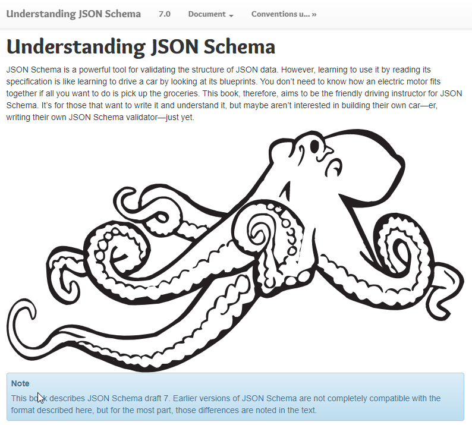
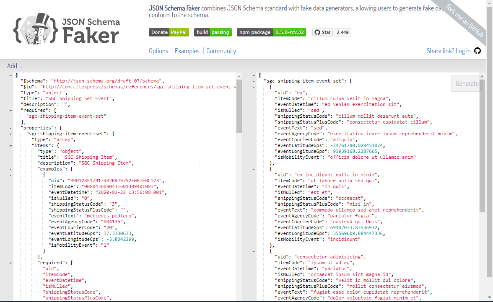
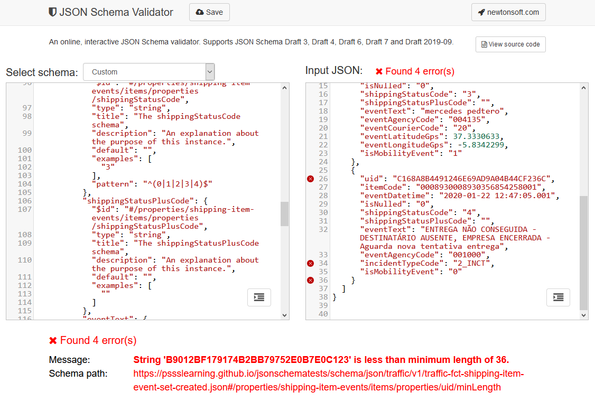

# Referencias

## Acceso público a los archivos del repositorio

[https://pssslearning.github.io/jsonschematests/](https://pssslearning.github.io/jsonschematests/)

- Schemas:
    - https://pssslearning.github.io/jsonschematests/schema/json/traffic/v1/traffic-fct-shipping-item-event-set-created.json
      - Samples:
        - https://pssslearning.github.io/jsonschematests/samples/json/traffic/v1/traffic-fct-shipping-item-event-set-created.json
    - https://pssslearning.github.io/jsonschematests/schema/json/unspecific/v1/unspecific-fct-acknowledgement-v1.json
      - Samples:
        - https://pssslearning.github.io/jsonschematests/samples/json/unspecific/v1/unspecific-fct-acknowledgement-v1-OK.json
        - https://pssslearning.github.io/jsonschematests/samples/json/unspecific/v1/unspecific-fct-acknowledgement-v1-KO.json

## Apache Kafka: Topic Naming Conventions (devshawn.com)

[Apache Kafka: Topic Naming Conventions (devshawn.com)](https://devshawn.com/blog/apache-kafka-topic-naming-conventions/#)

### Naming Structure
My recommendation is to follow the following naming convention:

```
<data-center>.<domain>.<classification>.<description>.<version>
```

Let’s discuss what each part of the name means:

- **Data Center**  
    The data center which the data resides in. This is not required, but is helpful when an organization reaches the size 
    where they would like to do an active/active setup or replicate data between data centers. 
    For example, if you have one cluster in AWS and one in Azure, your topics may be prefixed with `aws` and `azure`.

- **Domain**  
    A domain for the data is a well understood, permanent name for the area of the system the data relates to. 
    ***These should not include any product names, team names, or service names***.
    
    Examples of this vary wildly between industries. For example, in a transportation organization, some domains might be:
    
    - `comms`: all events relating to device communications
    - `fleet`: all events relating to trucking fleet management
    - `identity`: all events relating to identity and auth services

- **Classification**  
    The classification of data within a Kafka topic tells an end-user how it should be interpreted or used. 
    This should not tell us about data format or contents. I typically use the following classifications:

    - `fct`: Fact data is information about a thing **that has happened (past tense verb)**. It is an immutable event at a specific point in time. 
             Examples of this include data from sensors, user activity events, or notifications.
    - `cdc`: Change data capture (CDC) indicates this topic contains all instances of a specific thing and receives all 
             changes to those things. These topics do not capture deltas and can be used to repopulate data stores or caches. These are commonly found as compacted topics within Kafka.
    - `cmd`: Command topics represent operations that occur against the system. 
             This is typically found as the `request-response pattern`, where you have a verb and a statement. 
             Examples might include `UpdateUser` and `UserUpdated`.
    - `sys`: System topics are used for internal topics within a single service. 
             They are operational topics that do not contain any relevant information outside of the owning system. 
             These topics are not meant for public consumption.

- **Description**  
    The description is arguably the most important part of the name and is the event name that describes the type of 
    data the topic holds. This is the subject of the data, such as `customers`, `invoices`, `users`, `payments`, etc.

- **Version**  
    The version of a topic is often the most forgotten section of a proper topic name. As data evolves within a topic, 
    there may be breaking schema changes or a complete change in the format of the data. 
    By versioning topics, you can allow a transitionary period where consumers can switch to the new data without 
    impacting any old consumers.
    ***By convention, it is preferred to version all topics and to start them at 0.***

- **Examples**
    
    Examples, using the following convention, may be:

    - `aws.analytics.fct.pageviews.0`
    - `azure.comms.fct.gps.0`
    - `dc1.identity.cdc.users.1`
    - `gcp.notifications.cmd.emails.3`
    - `gcp.notifications.sys.email-cache.0`

## JSON Schema

### **Understanding JSON Schema**

[Understanding JSON Schema](https://json-schema.org/understanding-json-schema/)




### **Structuring a complex schema**

[Structuring a complex schema](https://json-schema.org/understanding-json-schema/structuring.html)


### **JSON Schema Tool (from JSON to JSON Schema)**

[https://jsonschema.net/home](https://jsonschema.net/home)


### **JSON Schema Faker**

[JSON Schema Faker](https://json-schema-faker.js.org/) combines JSON Schema standard with fake data generators, allowing users to generate fake data 
that conform to the schema.




### **JSON Schema Validator**

[JSON Schema Validator](https://www.jsonschemavalidator.net/)

